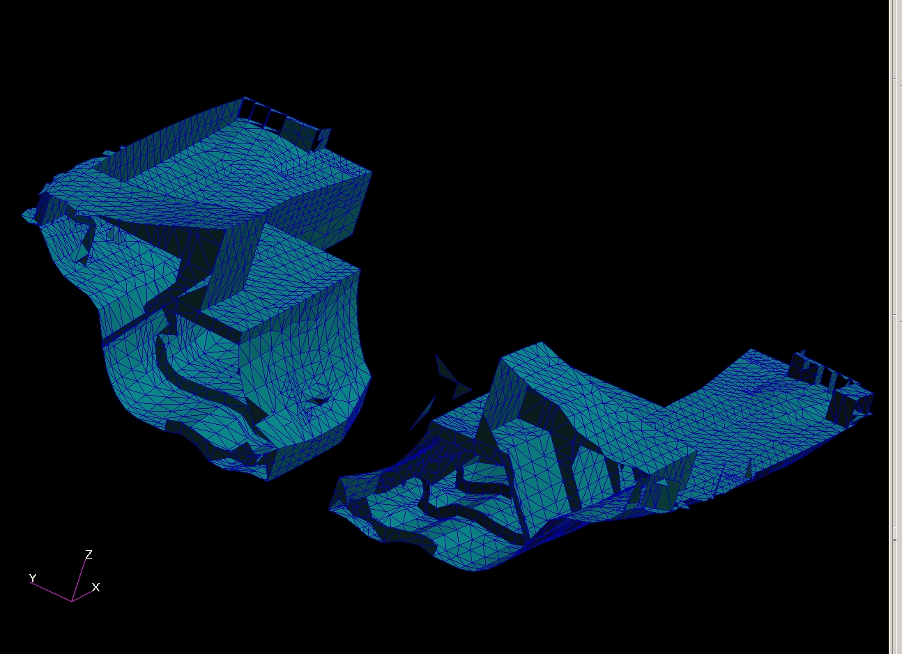

# ========================================
# Utility to Determine FEM Element SubCavity Membership From NASTRAN Multi-Cavity FEM:
# ========================================

## Utility to Determine FEM Element SubCavity Membership From NASTRAN Multi-Cavity FEM.

##
## I. NASTRAN Multi-Cavity FEM:

##
## II. Utility Executable: "./bin/sphere.exe"

##
## III. Utility Input File: "./input/input.bdf"
    =================================
    START: "input.bdf"
    =================================
    ... CONTENT REMOVED ...
    $ Direct Text Input for Global Case Control Data
    SUBCASE 1
    $ Subcase name : Default
       SUBTITLE=Default
       NLPARM = 1
       THERMAL(SORT1,PRINT)=ALL
       FLUX(SORT1,PRINT)=ALL
    BEGIN BULK
    PARAM    POST    0
    PARAM    AUTOSPC YES
    PARAM    SIGMA   1.714-9
    NLPARM   1       0               AUTO    5       25      PW      NO
                     .001    1.-7
    $ Direct Text Input for Bulk Data
    $ Elements and Element Properties for region : pshell.224
    PSHELL*  224             1               .00667
    *
    $ Pset: "pshell.224" will be imported as: "pshell.224"
    CTRIA3   28140   224     18034   18028   18062   0.
    CTRIA3   28341   224     21480   21506   21474   84.544
    CTRIA3   54553   224     7879    7882    7883   -57.21
    CTRIA3   54554   224     7883    7880    7879   -57.21
    CTRIA3   71763   224     17050   423     422    -95.542
    ... CONTENT REMOVED ...
    GRID     26624           35.375  0.      9.818
    GRID     26625           35.375  .395    9.779
    GRID     26626           35.375  .776    9.664
    GRID     26627           35.375  1.126   9.477
    GRID     26628           35.375  1.433   9.225
    GRID     26629           35.375  1.685   8.918
    GRID     26630           35.375  1.872   8.567
    GRID     26631           35.375  1.988   8.187
    $ Loads for Load Case : Default
    $ Default Initial Temperature
    TEMPD    1       0.
    $ Referenced Coordinate Frames
    ENDDATA 24f7ba69
    =================================
    END: "input.bdf"
    =================================

##
## IV. Utility Output Files:
### IV.a. "./output/output.bdf"
### IV.b. "./output/ignore.bdf"
### IV.c. "./output/i_array_front.bin"
### IV.d. "./output/i_array_back.bin"
### IV.e. "./output/cluster_data/"
    =================================
    START: "./output/cluster_data/"
    =================================
    "./output/cluster_data/group_1/1_clusters/cluster_1_1.dat"
    "./output/cluster_data/group_2/1_clusters/cluster_2_1.dat"
    "./output/cluster_data/group_3/1_clusters/cluster_3_1.dat"
    "./output/cluster_data/group_4/1_clusters/cluster_4_1.dat"
    "./output/cluster_data/group_5/1_clusters/cluster_5_1.dat"
    ... CONTENT REMOVED ...
    "./output/cluster_data/group_525/1_clusters/cluster_525_1.dat"
    "./output/cluster_data/group_526/1_clusters/cluster_526_1.dat"
    "./output/cluster_data/group_527/1_clusters/cluster_527_1.dat"
    "./output/cluster_data/group_528/1_clusters/cluster_528_1.dat"
    "./output/cluster_data/group_529/1_clusters/cluster_529_1.dat"
    =================================
    END: "./output/cluster_data/"
    =================================

### IV.f. "./output/cluster_bdf/"
    =================================
    START: "./output/cluster_bdf/"
    =================================
    "./output/cluster_bdf/group_1/1_clusters/cluster_1_1.bdf"
    "./output/cluster_bdf/group_2/1_clusters/cluster_2_1.bdf"
    "./output/cluster_bdf/group_3/1_clusters/cluster_3_1.bdf"
    "./output/cluster_bdf/group_4/1_clusters/cluster_4_1.bdf"
    "./output/cluster_bdf/group_5/1_clusters/cluster_5_1.bdf"
    ... CONTENT REMOVED ...
    "./output/cluster_bdf/group_525/1_clusters/cluster_525_1.bdf"
    "./output/cluster_bdf/group_526/1_clusters/cluster_526_1.bdf"
    "./output/cluster_bdf/group_527/1_clusters/cluster_527_1.bdf"
    "./output/cluster_bdf/group_528/1_clusters/cluster_528_1.bdf"
    "./output/cluster_bdf/group_529/1_clusters/cluster_529_1.bdf"
    =================================
    END: "./output/cluster_bdf/"
    =================================
